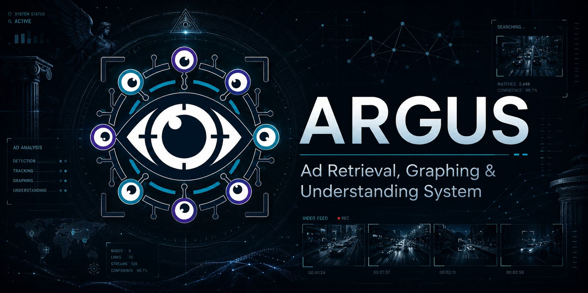

<div align="center">



# ARGUS

**Ad Retrieval, Graphing & Understanding System**

Multimodal ad analysis for video ads, marketing-entity extraction,
campaign discovery, hybrid retrieval, and a read-only natural-language agent.

[](https://python.org)
[](https://www.sqlite.org)

</div>

## Overview

ARGUS ingests local video advertisements and turns them into searchable,
structured records. It samples frames, extracts audio and transcripts, runs OCR,
collects deterministic rule evidence, asks a vision-language model to verify the
ad, writes marketing entities, and indexes both text and visual embeddings.

Implemented surfaces:

- classify ads against a configurable taxonomy
- extract brands, products, prices, offers, CTAs, disclaimers, contact points,
  social proof, and creative format
- search by keyword, text embedding, visual embedding, or hybrid retrieval
- search visual frames with SigLIP 2, including queries such as `red car`,
  `candidate podium`, `small disclaimer`, or `product hero shot`
- group related ads into campaigns
- ask a tool-calling natural-language agent questions over the local database

## Implemented Components

The repository includes the following runnable surfaces and local assets:

| Area | Implementation |
|---|---|
| Multimodal evidence records | Frame samples, transcript segments, raw OCR, optional GLM-OCR text, rule triggers, VLM evidence, and marketing entities. |
| Model benchmark page | `/benchmark` renders measured OpenRouter or OpenAI-compatible endpoint calls against five existing ad artifacts, with score, latency, token, cost, and per-ad breakdowns. |
| Local transcription fallback | Git LFS includes the Windows whisper.cpp runtime and `ggml-tiny.en.bin` for immediate local transcription after setup. |
| Application workflows | Library review, hybrid search, visual frame search, campaign grouping, campaign research, and a read-only natural-language agent. |

---

## Quick Start

Local setup commands:

```powershell
git lfs install
git clone https://github.com/LordLoras/ARGUS_vlm.git
cd ARGUS_vlm
git lfs pull

Copy-Item .\.env.local.example .\.env.local
Copy-Item .\config.example.yaml .\config.yaml
```

Put real key values in `.env.local`, not in Git and not in `config.yaml`.
Then follow the install section below for Python, torch, OCR, and frontend
dependencies.

Fast path after dependencies are installed:

```powershell
python -m ad_classifier init-db
.\start.bat
```

Open:

| Surface | URL |
|---|---|
| Frontend | `http://127.0.0.1:5173` |
| API docs | `http://127.0.0.1:8000/docs` |
| Model benchmark | `http://127.0.0.1:5173/benchmark` |

Verify LFS assets if transcription fails:

```powershell
dir models\whisper\ggml-tiny.en.bin
dir tools\whisper.cpp\whisper-cli.exe
```

Expected size: `ggml-tiny.en.bin` is about 77 MB. If it is only a few hundred
bytes, Git LFS was not installed or `git lfs pull` was not run.

---

## Installation

Recommended Windows setup path. Order matters: most setup problems come from
using a CPU-only torch build, missing ffmpeg on `PATH`, or starting ARGUS
before `config.yaml` and frontend dependencies exist.

Setup checklist:

1. Install Git LFS, Python, Node.js, ffmpeg, and an OpenAI-compatible inference
   engine for the VLM.
2. Create `.venv`, then install ARGUS Python dependencies.
3. Install the correct GPU torch build for your hardware, then install the
   embedding libraries with `--no-deps` (section 4).
4. Copy `.env.local.example` to `.env.local` and add keys locally.
5. Copy `config.example.yaml` to `config.yaml` and confirm the endpoint/model.
6. Run `python -m ad_classifier init-db`.
7. Run `.\start.bat`, then open `http://127.0.0.1:5173`.

### 1. Prerequisites

ARGUS is tested on Windows 11 with AMD GPUs and Python 3.12. NVIDIA GPUs
should work but are not tested; if torch fails to find the GPU, try creating
the venv with Python 3.12 instead.

Install or verify:

- Git with Git LFS enabled
- Python 3.12 (`python --version`). AMD ROCm wheels and the tested setup
  both target 3.12.
- Node.js 20.19+ (`node --version`)
- ffmpeg and ffprobe on `PATH` (`ffmpeg -version`)
- an inference engine that exposes an OpenAI-compatible chat completions
  endpoint for the VLM

### 2. Clone ARGUS

```powershell
git clone https://github.com/LordLoras/ARGUS_vlm.git
cd ARGUS_vlm
git lfs pull
```

`git lfs pull` downloads the bundled Windows whisper.cpp runtime and
`models/whisper/ggml-tiny.en.bin`. Large production models such as
`ggml-large-v3-turbo.bin` and GLM-OCR GGUF files are intentionally not tracked
in GitHub because they are hundreds of megabytes to multiple gigabytes.

### 3. Create the Python environment

```powershell
python -m venv .venv
.\.venv\Scripts\Activate.ps1

python -m pip install --upgrade pip setuptools wheel
```

`.[dev]` is a Python extra from `pyproject.toml`. It installs the editable ARGUS
package plus developer/test tools. It intentionally does not install OCR,
PyTorch, or embedding model packages.

For a normal local setup, use this order:

1. Install the editable app and dev tools:

   ```powershell
   python -m pip install -e ".[dev]"
   ```

2. Install the correct PyTorch wheel for your NVIDIA or AMD GPU using
   [section 4](#4-pytorch-and-embeddings).

3. Install the embedding packages without letting pip replace that torch wheel:

   ```powershell
   python -m pip install --no-deps sentence-transformers==3.0.1 transformers==4.57.6 tokenizers==0.22.1
   python -m pip install huggingface-hub==0.36.2 regex==2026.5.9 safetensors==0.7.0 scikit-learn==1.8.0
   ```

4. Install local OCR:

   ```powershell
   python -m pip install paddlepaddle==2.6.2
   python -m pip install paddleocr==2.7.3
   ```

Same commands as a compact copy/paste block:

```powershell
python -m pip install -e ".[dev]"
python -m pip install --no-deps sentence-transformers==3.0.1 transformers==4.57.6 tokenizers==0.22.1
python -m pip install huggingface-hub==0.36.2 regex==2026.5.9 safetensors==0.7.0 scikit-learn==1.8.0
python -m pip install paddlepaddle==2.6.2
python -m pip install paddleocr==2.7.3
```

Optional extras are available, but do not install them by default:

| Extra | Install when |
|---|---|
| `.[ocr]` | You want pip to install the pinned Paddle stack (`paddlepaddle==2.6.2`, `paddleocr==2.7.3`) instead of running the two manual OCR commands. Manual install is usually clearer on Windows. |
| `.[embeddings]` | Torch is already installed and you want pip to resolve the full embedding stack. For custom AMD/NVIDIA torch wheels, prefer the two manual embedding commands above. |
| `.[clustering]` | You are actively running campaign discovery experiments. |
| `.[qdrant]` | You are testing a future Qdrant vector backend. The default backend is `sqlite-vec`. |
| `.[whisper]` | You are switching from bundled whisper.cpp to `faster-whisper`. |

If PowerShell blocks activation for the current terminal session:

```powershell
Set-ExecutionPolicy -Scope Process RemoteSigned
.\.venv\Scripts\Activate.ps1
```

### 4. PyTorch and Embeddings

PyTorch is not listed as a dependency in `pyproject.toml`. A plain
`pip install torch` pulls the CPU-only build, which cannot run MiniLM or SigLIP
on the GPU. Install the correct wheel for the GPU vendor:

- **NVIDIA** — install the CUDA wheel from PyTorch's index. Check
  <https://pytorch.org/get-started/locally/> for the latest recommended CUDA
  version. The current stable build is CUDA 12.8:

  ```powershell
  pip install torch torchvision torchaudio --index-url https://download.pytorch.org/whl/cu128
  ```

- **AMD** — follow [section 5 below](#5-amd-rocm-on-windows) instead, then
  come back here for the embedding packages.

Verify torch sees the GPU:

```powershell
@'
import torch

print("torch:", torch.__version__)
print("cuda available:", torch.cuda.is_available())
print("device:", torch.cuda.get_device_name(0) if torch.cuda.is_available() else "cpu")
'@ | python -
```

#### Embedding Models

ARGUS uses two embedding models that both depend on PyTorch:

| Model | Role | Dimensions |
|---|---|---|
| `sentence-transformers/all-MiniLM-L6-v2` | Text vectors from transcript + OCR | 384 |
| `google/siglip2-base-patch16-224` | Visual vectors from keyframes and text-to-image search | 768 |

The `embeddings` extra in `pyproject.toml` records the pinned versions and
non-torch dependency constraints, but a base/dev install does not include it.
On Windows, install the embedding packages
explicitly in the active venv after torch is installed, without letting pip
resolve and replace the GPU torch build. The first command installs the packages
that can otherwise pull torch. The second command installs their non-torch
runtime dependencies:

```powershell
python -m pip install --no-deps sentence-transformers==3.0.1 transformers==4.57.6 tokenizers==0.22.1
python -m pip install huggingface-hub==0.36.2 regex==2026.5.9 safetensors==0.7.0 scikit-learn==1.8.0
```

`sentence-transformers` downloads MiniLM on first use. SigLIP 2 is loaded
through `transformers` the first time a visual query runs. Both models cache to
`~/.cache/huggingface/` by default.

When torch is not installed yet, mock embeddings can be used for tests or
`image_embedder.enabled: false` can be set in `config.yaml` until the GPU stack
is ready. Typed visual search still loads SigLIP 2, so `visual` and
`visual_hybrid` search modes require torch and transformers.

### 5. AMD ROCm on Windows

For an AMD GPU on Windows, install PyTorch from AMD's official ROCm Windows
instructions for the target driver, GPU, and Python version:

<https://rocm.docs.amd.com/projects/radeon-ryzen/en/latest/docs/install/installrad/windows/install-pytorch.html>

Practical notes:

- Python 3.12 is commonly used by current AMD Windows ROCm wheels. If the AMD
  install page lists Python 3.12 for the target wheel, create the venv with
  Python 3.12 instead of Python 3.11.
- Install torch first, then install ARGUS dependencies.
- Do not use `--upgrade` on packages that depend on torch unless reinstalling
  the AMD wheel is acceptable.
- If torch imports but reports CPU only, ARGUS will still run CPU jobs, but
  MiniLM and SigLIP 2 will be slow and visual vector search may feel unusable.

Verify the active torch build:

```powershell
@'
import torch

print("torch:", torch.__version__)
print("cuda available:", torch.cuda.is_available())
print("device:", torch.cuda.get_device_name(0) if torch.cuda.is_available() else "cpu")
'@ | python -
```

For ROCm Windows wheels, `torch.cuda.is_available()` is still the expected check
because PyTorch exposes the ROCm backend through the CUDA API surface.

### 6. Whisper Setup

`tools/whisper.cpp/whisper-cli.exe` and `models\whisper\ggml-tiny.en.bin` are
included through Git LFS for a working first run after clone.

For production transcription quality, download a larger whisper.cpp GGML model
from:

<https://huggingface.co/ggerganov/whisper.cpp>

For example, place one of these files under `models\whisper\`:

- `ggml-large-v3-turbo.bin` for better transcription quality
- `ggml-base.en.bin` or `ggml-small.en.bin` for lighter local testing
- `ggml-tiny.en.bin` for quick smoke tests

Then point `config.yaml` at it:

```yaml
whisper:
  backend: whisper_cpp
  whisper_cpp:
    command: ./tools/whisper.cpp/whisper-cli.exe
    model_path: ./models/whisper/ggml-tiny.en.bin
    use_gpu: true
```

The bundled whisper.cpp CLI can use GPU acceleration depending on the included
build and local driver stack. If transcription fails, set `use_gpu: false`
first to confirm the model path and audio extraction are correct.

### 7. VLM Setup

ARGUS expects an OpenAI-compatible chat completion endpoint for VLM
classification and marketing-entity extraction. Run any local or remote
inference engine that exposes an OpenAI-compatible chat completions API and has
access to a vision-capable model.

1. Start the inference engine.
2. Load or select a vision-capable model.
3. Confirm the engine exposes `/v1/chat/completions`.
4. Note the base endpoint URL and model name.

Configure ARGUS:

```powershell
Copy-Item .\config.example.yaml .\config.yaml
```

`config.example.yaml` is intentionally commented with valid choices and tuning
notes. After copying it, use `config.yaml` as the local setup reference and edit
the values there.

```yaml
vlm:
  mode: frontier
  remote:
    endpoint: "https://ai.ipdy.io/llm/v1"
    model: "model"
    api_key_env: "VLM_API_KEY"
  frontier:
    endpoint: "https://openrouter.ai/api/v1/chat/completions"
    model: "moonshotai/kimi-k2.5"
    api_key_env: "OPENROUTER_API_KEY"
```

When `agent.inherit_vlm` is enabled, the NL agent uses the same active
OpenAI-compatible endpoint as the classifier.

Put real key values in `.env.local`, not in `config.yaml`:

```powershell
Copy-Item .\.env.local.example .\.env.local
notepad .\.env.local
```

Local fallback setup:

```powershell
git clone https://github.com/LordLoras/ARGUS_vlm.git
cd ARGUS_vlm
git lfs pull
Copy-Item .\.env.local.example .\.env.local
Copy-Item .\config.example.yaml .\config.yaml
```

Then paste the shared keys into `.env.local`, install dependencies, initialize
SQLite, and run `.\start.bat`.

### Optional GLM-OCR

PaddleOCR remains the grounded raw OCR engine. It can be disabled with
`ocr.enabled: false`, but the only raw OCR backend supported here is local
PaddleOCR.

GLM-OCR is intended for text-heavy frames, end cards, article graphics, and CTA
screens. When a local GLM-OCR inference endpoint is running, it can be enabled
for normal local ingestion; the worker calls it on demand only for selected frames.
It is stored separately with engine `glm_ocr` in
`ocr_items` and included in search text when `glm_ocr.include_in_search: true`.
It is not included in the classifier VLM bundle unless
`glm_ocr.include_in_vlm_bundle: true`.

The example config mirrors the current production-style setup and enables the
local GLM-OCR hard-frame pass. If no OpenAI-compatible GLM-OCR engine is
listening on port `5050`, set `glm_ocr.enabled: false`; the main PaddleOCR path
will still run.

```yaml
glm_ocr:
  enabled: true
  mode: local
  prompt: "Transcribe all visible text exactly. Preserve line breaks and reading order. Do not summarize or infer."
  include_in_search: true
  include_in_vlm_bundle: false
  local:
    endpoint: "http://127.0.0.1:5050/v1"
    model: "glm-ocr"
```

Keep `temperature: 0` for OCR. Treat GLM-OCR numeric/legal fine print as
advisory unless PaddleOCR, transcript, or another frame corroborates it.

### 8. Initialize and Run

Install the frontend dependencies once:

```powershell
cd frontend
npm ci
cd ..
```

Initialize the SQLite database, then start the API, worker, and frontend:

```powershell
python -m ad_classifier init-db
.\start.bat
```

`start.bat` opens separate command windows for the API, worker, and Vite
frontend. It also frees the default API/frontend ports first, so avoid it when
another process must remain on ports `8000` or `5173`.

Default local services:

| Service | URL |
|---|---|
| API | `http://localhost:8000` |
| API docs | `http://localhost:8000/docs` |
| Frontend | `http://localhost:5173` |

The frontend toolchain is pinned to Vite 7 and `@vitejs/plugin-react` 5. If a
fresh install prints Vite 8 warnings such as `Invalid key: jsx`, delete
`frontend\node_modules` and rerun `npm ci`; that warning means the local install
resolved an incompatible Vite 8 toolchain, not that ARGUS data is at risk.

### Authentication

For deployments that need a login gate, configure authentication in
`frontend/.env.local` (the file is ignored by git):

```powershell
cd frontend
Set-Content .env.local @"
ARGUS_AUTH_ENABLED=true
ARGUS_AUTH_MODE=login
ARGUS_AUTH_USERS=analyst:change-this-password
ARGUS_AUTH_REALM=ARGUS
ARGUS_AUTH_SESSION_TTL_HOURS=12
"@
npm run dev
```

Add users as comma-separated `username:password` pairs. Set
`ARGUS_AUTH_MODE=basic` for the browser-native Basic Auth prompt instead of the
themed login page. Authentication is disabled by default.

### First-Run Checks

- `http://127.0.0.1:8000/docs` loads the FastAPI docs.
- `http://127.0.0.1:5173` loads the ARGUS frontend.
- The worker window says it launched the SQLite-backed worker.
- The OpenAI-compatible VLM inference engine is running before ad upload.
- For visual search, the torch verification command above reports a usable GPU
  or the image embedder is configured for CPU.

---

## Usage

After `start.bat` is running, the frontend is the main operator surface. The
backend remains the production contract: JSON endpoints, SSE streams, SQLite,
artifact directories, and read-only public/agent surfaces.

### Frontend

```powershell
cd frontend
npm ci
npm run dev
```

Primary pages:

| Page | Path |
|---|---|
| Library | `/library` |
| Upload | `/upload` |
| Search | `/search` |
| Campaigns | `/campaigns` |
| Agent | `/agent` |
| Embeddings | `/embeddings` |
| Benchmark | `/benchmark` |
| About | `/about` |

---

### Visual Search

ARGUS stores one ad-level visual vector and per-keyframe visual vectors. The
per-frame index lets visual queries return the best matching frames rather than
only a whole-ad score.

Useful query examples:

- `red car`
- `candidate podium`
- `small disclaimer`
- `news article screenshot`
- `product hero shot`
- `doctor office`
- `mobile app screen`
- `before and after comparison`

Typed visual queries are expanded into a small set of visual phrases, but ARGUS
searches those phrases separately and keeps the best cosine match per ad. It
does not average `car`, `automobile`, `vehicle`, etc. into one diluted query
vector. Broad category terms such as `car`, `suv`, and `doctor` also use the
same lightweight query-intent filter as hybrid search to reduce unrelated
category bleed after the visual score gate.

For existing ads processed before per-frame indexing was added, backfill visual
frame vectors with:

```powershell
python -m ad_classifier reindex-visual-frames
```

---

### API Highlights

| Method | Endpoint | Purpose |
|---|---|---|
| `POST` | `/api/ads/upload` | Upload a video and create a job |
| `GET` | `/api/ads` | List ads with filters |
| `GET` | `/api/ads/{id}` | Fetch ad detail, classification, and entities |
| `GET` | `/api/ads/{id}/frames` | Fetch frame metadata |
| `GET` | `/api/ads/{id}/evidence` | Fetch evidence and rule triggers |
| `GET` | `/api/ads/{id}/similar` | Retrieve similar ads |
| `GET` | `/api/search` | Keyword, text vector, visual, or hybrid search |
| `POST` | `/api/campaigns/discover` | Scan campaign suggestions without persistence |
| `POST` | `/api/campaigns/discover/accept` | Accept selected suggestions as user assignments |
| `POST` | `/api/campaigns/{id}/ads` | Manually assign ads to a campaign |
| `POST` | `/api/campaigns/{id}/research/deep` | Run local campaign research and answer an optional analyst question |
| `GET` | `/api/jobs/{id}/events` | Stream job progress |
| `GET` | `/api/agent/sessions/{id}/events` | Stream agent responses |
| `GET` | `/api/public/ads` | List ads (API key required) |
| `GET` | `/api/public/ads/{id}` | Fetch ad detail (API key required) |
| `GET` | `/api/public/stats` | Aggregate stats (API key required) |
| `GET` | `/api/public/campaigns` | List campaigns (API key required) |

---

### Public API

ARGUS exposes a read-only public API under `/api/public/*` for external
integrations. Public endpoints require an API key passed via the `X-API-Key`
header or `api_key` query parameter.

Enable in `config.yaml`:

```yaml
api:
  public:
    enabled: true
    api_key: "<api-key>"
```

Committed examples keep `api_key: null`; in that state `/api/public/*` routes
return 403 until a local `config.yaml` sets a real key.

Public endpoints:

| Method | Endpoint | Purpose |
|---|---|---|
| `GET` | `/api/public/ads` | List ads with brand, category, risk, and search filters |
| `GET` | `/api/public/ads/{id}` | Full ad detail with classification, marketing entities, campaigns, frames, transcript, OCR, and rules |
| `GET` | `/api/public/ads/{id}/transcript` | Transcript segments and full text |
| `GET` | `/api/public/ads/{id}/ocr` | OCR items with frame references |
| `GET` | `/api/public/ads/{id}/frames` | Frame metadata |
| `GET` | `/api/public/stats` | Aggregate counts by category, brand, and risk label |
| `GET` | `/api/public/campaigns` | List campaigns |
| `GET` | `/api/public/campaigns/{id}` | Campaign detail with assigned ads |

Public responses strip internal fields such as source paths, hashes, and VLM
model metadata.

---

## Technical Details

The remaining sections explain how ARGUS works internally after the practical
run path is clear.

### Architecture

```text
Video upload
  -> ffmpeg frame/audio extraction
  -> whisper transcript
  -> frame preprocessing and keyframe selection
  -> OCR and optional hard-frame parsing
  -> post-OCR duplicate check
  -> deterministic rules
  -> evidence bundle
  -> VLM verification and marketing-entity extraction
  -> aggregation and persistence
  -> FTS5 + sqlite-vec indexing
  -> FastAPI, SSE, React UI, and read-only NL agent
```

Data lives in one SQLite database plus local artifact directories under `data/`.

---

### Core Components

| Area | Implementation |
|---|---|
| API | FastAPI with JSON endpoints and SSE job streams |
| Worker | Restartable local pipeline stages |
| Storage | SQLite in WAL mode |
| Full-text search | SQLite FTS5 |
| Vector search | sqlite-vec |
| Text embeddings | `sentence-transformers/all-MiniLM-L6-v2` |
| Visual embeddings | `google/siglip2-base-patch16-224` |
| OCR | PaddleOCR by default |
| Transcript | bundled whisper.cpp CLI + tiny model, faster-whisper, or mock backend |
| VLM | OpenAI-compatible local, hosted remote, or OpenRouter frontier endpoint |
| Frontend | Vite, React, TypeScript, Tailwind-style CSS |

---

### Technical Pipeline

ARGUS is a staged pipeline. Each stage writes structured artifacts or database
rows that later stages can reuse, inspect, or search. The worker is the
orchestrator; individual OCR, VLM, embedding, vector, dedup, and repository
modules stay behind narrow interfaces so they can be swapped or mocked.

#### 1. Upload and Job Creation

`POST /api/ads/upload` writes the incoming video to `data/uploads/`, computes a
SHA256 `source_hash`, derives the default `ad_id` from that hash, creates an
`ads` row, and queues a `jobs` row. Job progress is streamed over SSE from
`/api/jobs/{id}/events`.

The file hash is a byte-level exact duplicate check. Re-encoding the same video
with different bitrate, chroma, metadata, or container bytes changes this hash,
so exact dedup only catches identical uploaded files.

#### 2. Ingest Artifacts

The ingest stage uses ffmpeg/ffprobe to:

- probe duration, dimensions, and frame rate
- sample frames at `ingest.frame_interval_ms`
- extract mono 16 kHz audio
- run the configured Whisper backend
- write a chronological manifest sorted by explicit frame index and timestamp

Artifacts live under `data/frames/`, `data/audio/`, `data/whisper/`, and
`data/out/{ad_id}/`. Existing artifacts are reused unless the job is forced.

#### 3. Dedup and Similarity Layers

ARGUS uses three different similarity concepts. They answer different questions
and should not be treated as interchangeable.

| Layer | Signal | Purpose | Can short-circuit |
|---|---|---|---|
| Exact file hash | SHA256 of uploaded bytes | Same uploaded file | Yes, when `dedup.skip_on_exact: true` |
| Near creative hash | Mean perceptual hash over sampled frames | Visually near-identical creative | Only if `dedup.skip_on_near_duplicate: true` |
| Post-OCR duplicate | Frame pHashes plus raw OCR/transcript/offer signatures | Re-encoded exact same creative | Yes, when `dedup.post_ocr.skip_on_exact: true` |
| Semantic related ads | Text and visual embedding cosine similarity | Same campaign, variant, or related creative | No, enriches final result |

Mean pHash is tolerant to compression and small visual changes, but it is a
single summary of the whole video. If only a few offer/end-card frames differ,
it may still score as visually close. For that reason the default config records
near matches but does not skip them. The later semantic layer can then report
`same_campaign_different_sku` or another related-ad verdict while preserving the
distinct ad rows.

The post-OCR duplicate check runs after PaddleOCR and optional GLM-OCR have
written `ocr_items`, but before OCR cleanup, rules, VLM verification, and
embeddings. It first narrows candidates by duration and mean pHash distance,
then compares per-frame pHashes, normalized OCR text, transcript text, and a
commercial signature made from offer-like numbers and terms such as APR,
monthly payments, lease, tax, discount, and due-at-signing language. Only a
high frame match plus high text/transcript similarity plus high commercial
signature similarity becomes `exact_duplicate`. If the visuals are nearly the
same but the offer signature changes, the worker continues so the ads remain
separate rows and can later become campaign variants.

When an exact post-OCR match is found, ARGUS sets `ads.status = 'duplicate'`
and writes `ads.duplicate_of`, `ads.duplicate_verdict`, and
`ads.duplicate_score`. This catches re-encoded copies where SHA256 differs, but
it should not collapse cases such as two Jeep creatives with the same footage
and different offer/product end cards.

#### 4. Frame Preprocessing

Sampled frames are analyzed for blankness, blur, perceptual hash, near-duplicate
frames, and scene changes. The worker marks frames as kept or dropped in the
`frames` table. Kept frames are the input to OCR, visual embeddings, VLM frame
selection, and visual search.

#### 5. OCR and Document OCR

PaddleOCR is the grounded raw OCR source. It writes one row per detected text
item into `ocr_items`, including:

- frame id
- engine name (`paddleocr`)
- raw visible text
- bounding box JSON when available
- confidence when available

GLM-OCR is optional. When `glm_ocr.enabled: true`, the worker calls a configured
local or remote OpenAI-compatible GLM-OCR endpoint only for selected frames:

- low mean PaddleOCR confidence
- any low-confidence OCR item
- dense text frames
- many tiny OCR fragments
- blurry or low-quality frames
- frames with at least `glm_ocr.min_ocr_chars` OCR text

GLM-OCR output is stored separately as `ocr_items.engine = "glm_ocr"`. It has no
Paddle-style bounding boxes or confidence, so it is useful for search recall and
readable text enrichment, not as the authoritative source for prices, dates,
APR, or legal terms. Keep `glm_ocr.include_in_search: true` and
`glm_ocr.include_in_vlm_bundle: false` unless classifier prompts should include
GLM text.

#### 6. Transcript Alignment and Rules

Whisper segments are aligned to nearby frames using
`rules.alignment_window_ms`. The rules engine runs deterministic YAML-configured
patterns over OCR and transcript text. Rule triggers are persisted in
`rule_triggers` and later become structured evidence for classification,
marketing extraction, and API evidence views.

Rules add structured category and observation evidence used by classification,
search, and API evidence views.

#### 7. Evidence Bundle and VLM Verification

The evidence builder selects a compact frame set for the classifier VLM. When
there are more kept frames than `vlm.max_frames_in_bundle`, selection is
deterministic:

1. first and last kept frames
2. rule-trigger frames, ordered by severity
3. high OCR-density frames
4. time-distributed frames
5. frame-index tie-breakers

The VLM receives selected frame images, transcript text, OCR text, optional
document-OCR text, metadata, and rule triggers. It returns strict structured
JSON containing category, confidence, observation labels, evidence, OCR quality,
summary, and marketing entities.

Before cleanup and classification, ARGUS scores ad complexity from observable
inputs: OCR item count, total OCR text, the densest text frame, transcript
length, and kept-frame count. OCR-heavy ads automatically receive larger
generation budgets for OCR cleanup, VLM classification, and self-correction.
This is meant for dense end cards and fine print where a fixed `max_tokens`
budget can end with `finish_reason=length`.

Post-processing then runs deterministic checks:

- schema parsing and fallback handling
- VLM output validation against observed evidence
- optional OCR cleanup pass
- optional self-correction pass
- optional visual verification pass for brand/logo claims
- aggregation of VLM and rule evidence into the final classification

#### 8. Product Taxonomy and Marketing Entities

In addition to the project-level `primary_category`, the verifier selects one
IAB product taxonomy row from `Ad Product Taxonomy 2.0.tsv`. It chooses the
deepest tier directly supported by OCR/transcript/frame evidence and stores the
canonical ID, parent ID, tier labels, selected depth, selected label, full path,
confidence, and alternatives in `classifications.iab_category_json`.

The `ads` table also has IAB projection columns such as `iab_unique_id`,
`iab_tier_1`, and `iab_full_path` so the API, search, and agent tools can filter
or group by product taxonomy without parsing JSON.

Marketing entities are the structured business output of the pipeline. They
include brand, advertiser, products, prices, offers, CTAs, social proof,
disclaimers, landing-page/contact data, creative format, campaign suggestions,
and tracking fields.

The JSON in `marketing_entities` is the source of truth. Convenience projection
columns on `ads` such as `brand_name`, `products_text`, `primary_category`,
`website_domain`, and `phone_number` are updated in the same transaction so list
views and filters stay fast.

#### 9. Embeddings and Vector Storage

ARGUS writes two embedding families:

- Text: one ad-level vector from transcript plus searchable OCR text using
  `sentence-transformers/all-MiniLM-L6-v2`
- Visual: one vector per kept keyframe plus a mean-pooled ad-level vector using
  `google/siglip2-base-patch16-224`

Vectors are stored in SQLite through `sqlite-vec` tables. Per-frame visual
vectors let a text-to-image visual query return the best matching frame, not
only a whole-ad score.

#### 10. Search and Ranking

The search API supports several retrieval modes:

| Mode | Main signal | Typical use |
|---|---|---|
| Keyword | FTS5 over brand, product, category, transcript, OCR, entities | Exact words, brands, offers, phone numbers |
| Text vector | MiniLM ad-level embedding | Semantic text queries |
| Visual | SigLIP text-to-image over ad and frame visual vectors | Visual concepts such as vehicles, people, graphics, layouts |
| Hybrid | FTS + vectors + reciprocal rank fusion | Analyst search when both terms and semantics matter |
| Visual hybrid | Keyword grounding plus visual expansion | Prevents visual-only noise from dominating specific text queries |

Search adds query expansion for known business aliases, filters low-score FTS
noise, applies modality-specific score floors, and reranks result snippets using
database projections, FTS text, OCR, and transcript text. Visual similarities are
expected to be much lower numerically than text-vector similarities, so visual
thresholds are intentionally configured separately.

#### 11. Related Ads and Campaigns

After embeddings are written, ARGUS compares the new ad against existing text
and visual vectors. Similar ads are not merged. They are reported as
`related_ads.semantically_similar` with:

- overall score
- text score
- visual score
- verdict such as `same_campaign_different_sku`
- structured differences in brand, products, prices, offers, category, and
  subcategory

Campaign discovery is a separate user-triggered step. The default API path scans
brand-grouped signals and returns reviewable proposals without writing campaign
rows. Discovery uses repeated VLM-extracted campaign suggestions first, then
brand-scoped visual-vector clusters. Suggested names are normalized so a brand
prefix does not split the same phrase (`Jeep Declaration of Deals` and
`Declaration of Deals` group together), but no campaign names are hardcoded.
The repeated campaign signal must appear across at least
`campaigns.discover.min_cluster_size` ads, clear
`campaigns.discover.min_campaign_signal_confidence`, and remain visually
coherent enough to pass `campaigns.discover.min_mean_similarity`. Exact duplicate
proposal ad sets are deduped so the extracted campaign name wins over a generic
visual/offer label.

Accepting proposals creates user-owned campaign assignments, so accepted
suggestions become curated truth and are shielded from later automatic
rediscovery. Manual campaign creation and per-ad assignment use the same
`campaigns` and `ad_campaigns` tables with `created_by = 'user'` /
`assigned_by = 'user'`.

Campaign detail includes an analyst research mode exposed at
`POST /api/campaigns/{id}/research/deep`. It does not call the internet. It
builds a local evidence bundle from assigned ads, structured marketing
entities, classification tags, OCR/GLM-OCR excerpts, transcript excerpts,
campaign suggestions, and assignment scores. The configured OpenAI-compatible
agent LLM then turns that evidence into the visible findings, creative review,
suggested edits, open questions, and optional grounded answer. If the LLM is
unavailable or returns unusable output, the endpoint returns a clearly marked
local metric fallback. The request shape already carries `include_web`,
`question`, and `thinking` fields so a later web research pass can be added
without changing the frontend contract.

For operational backfills, `POST /api/campaigns/discover?persist=true` and the
CLI discovery command still persist auto-created campaigns directly. Auto
campaigns never overwrite user-created campaigns with the same id.

#### 12. Agent Interface

The natural-language agent is tool-calling, not text-to-SQL by default. It uses
a fixed catalog of read-only tools for listing ads, counting ads, aggregating
fields, fetching campaign/ad detail, FTS search, vector similarity, hybrid
search, and a bounded read-only SQL escape hatch.

The agent database connection is opened read-only with `PRAGMA query_only = ON`.
Sessions, messages, tool calls, and tool results are audited in
`agent_sessions` and `agent_messages`.

#### 13. Runtime Surfaces

The backend exposes three main surfaces:

- FastAPI JSON endpoints for upload, library views, detail views, search,
  campaigns, frames, evidence, similar ads, and a read-only public API
- SSE streams for job progress and agent responses
- a decoupled Vite/React frontend that consumes only the HTTP/SSE API

The frontend is not part of the pipeline contract. The backend owns ingestion,
persistence, retrieval, and the agent; the UI is a client over JSON and SSE.

---

### GPU Usage

Different parts of ARGUS use different acceleration paths:

| Component | Uses GPU when |
|---|---|
| VLM classification | The OpenAI-compatible inference engine is configured for GPU |
| GLM-OCR | The configured local/remote GLM-OCR inference engine is configured for GPU |
| Whisper transcript | `whisper.whisper_cpp.use_gpu: true` and the bundled CLI works with the installed driver |
| PaddleOCR | Usually CPU by default in this project |
| MiniLM text embeddings | `text_embedder.device: cuda` and torch GPU is available |
| SigLIP 2 visual embeddings | `image_embedder.device: cuda` and torch GPU is available |
| Visual vector search | A typed visual query loads SigLIP 2; GPU is used if the image embedder is on `cuda` |

Visual vector search does not add tokens to the agent context. Vectors are stored
physically in SQLite/sqlite-vec. The agent only receives selected search results,
metadata, and citations returned by its tools.

---

### Testing

```powershell
python -m pytest tests/ -q
npm run build --prefix frontend
```

Focused search/vector checks:

```powershell
python -m pytest tests/search tests/vectors tests/agent/test_tools.py -q
```

---

### Repository Layout

```text
ad_classifier/
  api/            FastAPI routes, middleware, and SSE endpoints
  agent/          Tool-calling NL agent
  cli/            Operational and diagnostic commands
  db/             SQLite connection, migrations, repositories
  dedup/          Hash, perceptual hash, and vector similarity
  embeddings/     Text and image embedders
  ingest/         ffmpeg and transcript extraction
  marketing/      Marketing-entity normalization and enrichment
  pipeline/       OCR, rules, evidence, aggregation
  search/         FTS, query expansion, RRF, visual retrieval
  vectors/        sqlite-vec storage
  vlm/            VLM verifier, cleanup, correction, validation
  worker/         Pipeline orchestration
frontend/
  src/            React application
  logo.png        ARGUS icon asset
  banner.jpg      ARGUS banner asset
```

---

## Troubleshooting

**The VLM returns malformed JSON.** Use `response_format: json_object` for local
quantized models. Reserve strict schema mode for endpoints that reliably support
structured output.

**Visual search returns only whole-ad matches.** Run
`python -m ad_classifier reindex-visual-frames` for ads processed before the
per-frame index existed.

**PaddleOCR fails to import.** Install the pinned versions with
`python -m pip install paddlepaddle==2.6.2` followed by
`python -m pip install paddleocr==2.7.3`.

**`sentence-transformers is not installed`.** Install the embedding libraries in
the same active venv that runs ARGUS:
`python -m pip install --no-deps sentence-transformers==3.0.1 transformers==4.57.6 tokenizers==0.22.1`,
then install the non-torch dependencies:
`python -m pip install huggingface-hub==0.36.2 regex==2026.5.9 safetensors==0.7.0 scikit-learn==1.8.0`.

**SigLIP or sentence-transformers tries to change torch.** Reinstall those
packages using the two embedding commands above, then verify the existing torch
build before running the worker.

**Visual search fails when the rest of the app works.** Typed visual queries load
the SigLIP 2 model through transformers and torch. Confirm the embedding
packages are installed, then verify torch can see the GPU or switch the image
embedder to CPU.

**The agent cannot answer a search question.** Confirm the API has initialized
sqlite-vec tables and the agent is using the configured vector store factory.

**Vite prints `Invalid key: jsx`.** This is a dev toolchain mismatch, not a
data warning. Stop Vite, delete `frontend\node_modules`, and run `npm ci` so the
lockfile installs the pinned Vite 7 toolchain.

**Whisper is missing after clone.** Run `git lfs pull` and confirm
`tools\whisper.cpp\whisper-cli.exe` and
`models\whisper\ggml-tiny.en.bin` exist.
