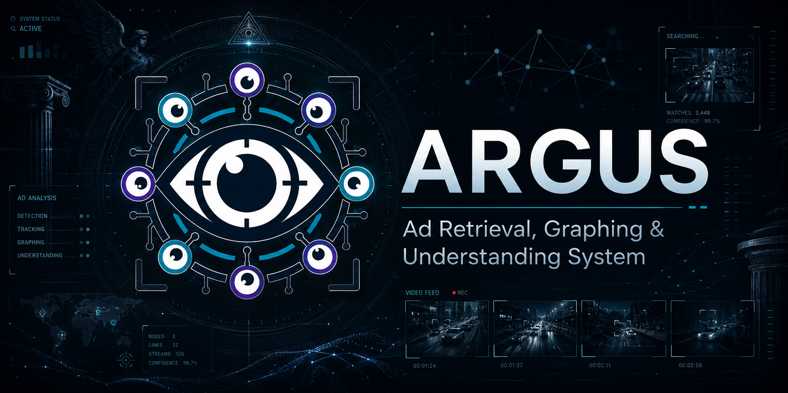

<div align="center">



# ARGUS

**Ad Retrieval, Graphing & Understanding System**

Local-first multimodal ad analysis for video ads, marketing-entity extraction,
campaign discovery, hybrid retrieval, and a read-only natural-language agent.

[](https://python.org)
[](https://www.sqlite.org)

</div>

---

## Overview

ARGUS ingests local video advertisements and turns them into searchable,
structured records. It samples frames, extracts audio and transcripts, runs OCR,
collects deterministic rule evidence, asks a vision-language model to verify the
ad, writes marketing entities, and indexes both text and visual embeddings.

The system is designed for analyst workflows:

- classify ads against a configurable taxonomy
- extract brands, products, prices, offers, CTAs, disclaimers, contact points,
  social proof, and creative format
- search by keyword, text embedding, visual embedding, or hybrid retrieval
- search visual frames with SigLIP 2, including queries such as `red car`,
  `candidate podium`, `small disclaimer`, or `product hero shot`
- group related ads into campaigns
- ask a tool-calling natural-language agent questions over the local database

ARGUS is categorization-only. It does not gate, approve, block, escalate, or
route ads for review. Risk labels are descriptive observation tags for analysis
and search.

---

## What Is Included

This repository contains the ARGUS backend, worker, React frontend, SQLite
migrations, search tooling, and the Windows `whisper-cli.exe` binary under
`tools/whisper.cpp/`.

The repository does not include:

- Whisper `.bin` model files
- a running VLM or downloaded VLM weights
- ffmpeg / ffprobe
- Python, Node.js, or Git
- PyTorch GPU wheels
- PaddleOCR runtime model caches

This matters because a fresh clone can start the app code, but full ingestion
needs the external binaries and model files described below.

---

## Architecture

```text
Video upload
  -> ffmpeg frame/audio extraction
  -> whisper transcript
  -> frame preprocessing and keyframe selection
  -> OCR and optional hard-frame parsing
  -> post-OCR duplicate check
  -> deterministic rules
  -> evidence bundle
  -> VLM verification and marketing-entity extraction
  -> aggregation and persistence
  -> FTS5 + sqlite-vec indexing
  -> FastAPI, SSE, React UI, and read-only NL agent
```

Data lives in one SQLite database plus local artifact directories under `data/`.
The default deployment does not require Docker or cloud services.

---

## Core Components

| Area | Implementation |
|---|---|
| API | FastAPI with JSON endpoints and SSE job streams |
| Worker | Restartable local pipeline stages |
| Storage | SQLite in WAL mode |
| Full-text search | SQLite FTS5 |
| Vector search | sqlite-vec |
| Text embeddings | `sentence-transformers/all-MiniLM-L6-v2` |
| Visual embeddings | `google/siglip2-base-patch16-224` |
| OCR | PaddleOCR by default |
| Transcript | bundled whisper.cpp CLI, faster-whisper, or mock backend |
| VLM | OpenAI-compatible local or remote endpoint |
| Frontend | Vite, React, TypeScript, Tailwind-style CSS |

---

## Technical Pipeline

ARGUS is a staged pipeline. Each stage writes structured artifacts or database
rows that later stages can reuse, inspect, or search. The worker is the
orchestrator; individual OCR, VLM, embedding, vector, dedup, and repository
modules stay behind narrow interfaces so they can be swapped or mocked.

### 1. Upload and Job Creation

`POST /api/ads/upload` writes the incoming video to `data/uploads/`, computes a
SHA256 `source_hash`, derives the default `ad_id` from that hash, creates an
`ads` row, and queues a `jobs` row. Job progress is streamed over SSE from
`/api/jobs/{id}/events`.

The file hash is a byte-level exact duplicate check. Re-encoding the same video
with different bitrate, chroma, metadata, or container bytes changes this hash,
so exact dedup only catches identical uploaded files.

### 2. Ingest Artifacts

The ingest stage uses ffmpeg/ffprobe to:

- probe duration, dimensions, and frame rate
- sample frames at `ingest.frame_interval_ms`
- extract mono 16 kHz audio
- run the configured Whisper backend
- write a chronological manifest sorted by explicit frame index and timestamp

Artifacts live under `data/frames/`, `data/audio/`, `data/whisper/`, and
`data/out/{ad_id}/`. Existing artifacts are reused unless the job is forced.

### 3. Dedup and Similarity Layers

ARGUS uses three different similarity concepts. They answer different questions
and should not be treated as interchangeable.

| Layer | Signal | Purpose | Can short-circuit |
|---|---|---|---|
| Exact file hash | SHA256 of uploaded bytes | Same uploaded file | Yes, when `dedup.skip_on_exact: true` |
| Near creative hash | Mean perceptual hash over sampled frames | Visually near-identical creative | Only if `dedup.skip_on_near_duplicate: true` |
| Post-OCR duplicate | Frame pHashes plus raw OCR/transcript/offer signatures | Re-encoded exact same creative | Yes, when `dedup.post_ocr.skip_on_exact: true` |
| Semantic related ads | Text and visual embedding cosine similarity | Same campaign, variant, or related creative | No, enriches final result |

Mean pHash is tolerant to compression and small visual changes, but it is a
single summary of the whole video. If only a few offer/end-card frames differ,
it may still score as visually close. For that reason the default config records
near matches but does not skip them. The later semantic layer can then report
`same_campaign_different_sku` or another related-ad verdict while preserving the
distinct ad rows.

The post-OCR duplicate check runs after PaddleOCR and optional GLM-OCR have
written `ocr_items`, but before OCR cleanup, rules, VLM verification, and
embeddings. It first narrows candidates by duration and mean pHash distance,
then compares per-frame pHashes, normalized OCR text, transcript text, and a
commercial signature made from offer-like numbers and terms such as APR,
monthly payments, lease, tax, discount, and due-at-signing language. Only a
high frame match plus high text/transcript similarity plus high commercial
signature similarity becomes `exact_duplicate`. If the visuals are nearly the
same but the offer signature changes, the worker continues so the ads remain
separate rows and can later become campaign variants.

When an exact post-OCR match is found, ARGUS sets `ads.status = 'duplicate'`
and writes `ads.duplicate_of`, `ads.duplicate_verdict`, and
`ads.duplicate_score`. This catches re-encoded copies where SHA256 differs, but
it should not collapse cases such as two Jeep creatives with the same footage
and different offer/product end cards.

### 4. Frame Preprocessing

Sampled frames are analyzed for blankness, blur, perceptual hash, near-duplicate
frames, and scene changes. The worker marks frames as kept or dropped in the
`frames` table. Kept frames are the input to OCR, visual embeddings, VLM frame
selection, and visual search.

### 5. OCR and Document OCR

PaddleOCR is the grounded raw OCR source. It writes one row per detected text
item into `ocr_items`, including:

- frame id
- engine name (`paddleocr`)
- raw visible text
- bounding box JSON when available
- confidence when available

GLM-OCR is optional. When `glm_ocr.enabled: true`, the worker calls a configured
local or remote OpenAI-compatible GLM-OCR endpoint only for selected frames:

- low mean PaddleOCR confidence
- any low-confidence OCR item
- dense text frames
- many tiny OCR fragments
- blurry or low-quality frames
- frames with at least `glm_ocr.min_ocr_chars` OCR text

GLM-OCR output is stored separately as `ocr_items.engine = "glm_ocr"`. It has no
Paddle-style bounding boxes or confidence, so it is useful for search recall and
readable text enrichment, not as the authoritative source for prices, dates,
APR, or legal terms. Keep `glm_ocr.include_in_search: true` and
`glm_ocr.include_in_vlm_bundle: false` unless you explicitly want the classifier
to see GLM text.

### 6. Transcript Alignment and Rules

Whisper segments are aligned to nearby frames using
`rules.alignment_window_ms`. The rules engine runs deterministic YAML-configured
patterns over OCR and transcript text. Rule triggers are persisted in
`rule_triggers` and later become structured evidence for classification,
marketing extraction, and API evidence views.

Rules are descriptive. ARGUS is categorization-only: rules can add category or
observation evidence, but they never approve, block, gate, or escalate an ad.

### 7. Evidence Bundle and VLM Verification

The evidence builder selects a compact frame set for the classifier VLM. When
there are more kept frames than `vlm.max_frames_in_bundle`, selection is
deterministic:

1. first and last kept frames
2. rule-trigger frames, ordered by severity
3. high OCR-density frames
4. time-distributed frames
5. frame-index tie-breakers

The VLM receives selected frame images, transcript text, OCR text, optional
document-OCR text, metadata, and rule triggers. It returns strict structured
JSON containing category, confidence, observation labels, evidence, OCR quality,
summary, and marketing entities.

Post-processing then runs deterministic checks:

- schema parsing and fallback handling
- VLM output validation against observed evidence
- optional OCR cleanup pass
- optional self-correction pass
- optional visual verification pass for brand/logo claims
- aggregation of VLM and rule evidence into the final classification

### 8. Marketing Entities and Projections

Marketing entities are the structured business output of the pipeline. They
include brand, advertiser, products, prices, offers, CTAs, social proof,
disclaimers, landing-page/contact data, creative format, campaign suggestions,
and tracking fields.

The JSON in `marketing_entities` is the source of truth. Convenience projection
columns on `ads` such as `brand_name`, `products_text`, `primary_category`,
`website_domain`, and `phone_number` are updated in the same transaction so list
views and filters stay fast.

### 9. Embeddings and Vector Storage

ARGUS writes two embedding families:

- Text: one ad-level vector from transcript plus searchable OCR text using
  `sentence-transformers/all-MiniLM-L6-v2`
- Visual: one vector per kept keyframe plus a mean-pooled ad-level vector using
  `google/siglip2-base-patch16-224`

Vectors are stored in SQLite through `sqlite-vec` tables. Per-frame visual
vectors let a text-to-image visual query return the best matching frame, not
only a whole-ad score.

### 10. Search and Ranking

The search API supports several retrieval modes:

| Mode | Main signal | Typical use |
|---|---|---|
| Keyword | FTS5 over brand, product, category, transcript, OCR, entities | Exact words, brands, offers, phone numbers |
| Text vector | MiniLM ad-level embedding | Semantic text queries |
| Visual | SigLIP text-to-image over ad and frame visual vectors | Visual concepts such as vehicles, people, graphics, layouts |
| Hybrid | FTS + vectors + reciprocal rank fusion | Analyst search when both terms and semantics matter |
| Visual hybrid | Keyword grounding plus visual expansion | Prevents visual-only noise from dominating specific text queries |

Search adds query expansion for known business aliases, filters low-score FTS
noise, applies modality-specific score floors, and reranks result snippets using
database projections, FTS text, OCR, and transcript text. Visual similarities are
expected to be much lower numerically than text-vector similarities, so visual
thresholds are intentionally configured separately.

### 11. Related Ads and Campaigns

After embeddings are written, ARGUS compares the new ad against existing text
and visual vectors. Similar ads are not merged. They are reported as
`related_ads.semantically_similar` with:

- overall score
- text score
- visual score
- verdict such as `same_campaign_different_sku`
- structured differences in brand, products, prices, offers, category, and
  subcategory

Campaign discovery is a separate user-triggered step. The default API path scans
brand-grouped signals and returns reviewable proposals without writing campaign
rows. Discovery uses repeated VLM-extracted campaign suggestions first, then
brand-scoped visual-vector clusters. Suggested names are normalized so a brand
prefix does not split the same phrase (`Jeep Declaration of Deals` and
`Declaration of Deals` group together), but no campaign names are hardcoded.
The repeated campaign signal must appear across at least
`campaigns.discover.min_cluster_size` ads, clear
`campaigns.discover.min_campaign_signal_confidence`, and remain visually
coherent enough to pass `campaigns.discover.min_mean_similarity`. Exact duplicate
proposal ad sets are deduped so the extracted campaign name wins over a generic
visual/offer label.

Accepting proposals creates user-owned campaign assignments, so accepted
suggestions become curated truth and are shielded from later automatic
rediscovery. Manual campaign creation and per-ad assignment use the same
`campaigns` and `ad_campaigns` tables with `created_by = 'user'` /
`assigned_by = 'user'`.

For operational backfills, `POST /api/campaigns/discover?persist=true` and the
CLI discovery command still persist auto-created campaigns directly. Auto
campaigns never overwrite user-created campaigns with the same id.

### 12. Agent Interface

The natural-language agent is tool-calling, not text-to-SQL by default. It uses
a fixed catalog of read-only tools for listing ads, counting ads, aggregating
fields, fetching campaign/ad detail, FTS search, vector similarity, hybrid
search, and a bounded read-only SQL escape hatch.

The agent database connection is opened read-only with `PRAGMA query_only = ON`.
Sessions, messages, tool calls, and tool results are audited in
`agent_sessions` and `agent_messages`.

### 13. Runtime Surfaces

The backend exposes three main surfaces:

- FastAPI JSON endpoints for upload, library views, detail views, search,
  campaigns, frames, evidence, and similar ads
- SSE streams for job progress and agent responses
- a decoupled Vite/React frontend that consumes only the HTTP/SSE API

The frontend is not part of the pipeline contract. The backend owns ingestion,
persistence, retrieval, and the agent; the UI is a client over JSON and SSE.

---

## Installation

### 1. Prerequisites

ARGUS is primarily developed for Windows 11.

Install or verify:

- Git
- Python 3.11+ (`python --version`)
- Node.js 18+ (`node --version`)
- ffmpeg and ffprobe on `PATH` (`ffmpeg -version`)
- LM Studio, llama.cpp server, vLLM, or another OpenAI-compatible VLM endpoint

### 2. Clone ARGUS

```powershell
git clone https://github.com/LordLoras/ARGUS_vlm.git
cd ARGUS_vlm
```

### 3. Create the Python environment

```powershell
python -m venv .venv
.\.venv\Scripts\Activate.ps1

python -m pip install --upgrade pip setuptools wheel
python -m pip install -e ".[dev]"
```

Install OCR separately on Windows. Installing `paddlepaddle` first usually gives
clearer errors if the Paddle stack has a platform issue:

```powershell
python -m pip install paddlepaddle
python -m pip install paddleocr
```

You can also install the OCR extra after that:

```powershell
python -m pip install -e ".[ocr,dev]"
```

### 4. PyTorch and Embeddings

Do not run this in a production ARGUS environment unless you intentionally want
to replace the existing GPU build:

```powershell
pip install torch torchvision torchaudio
```

PyTorch is intentionally not listed as a direct dependency in `pyproject.toml`.
Windows GPU wheels are hardware-specific, and a normal `pip install` can replace
a working AMD/NVIDIA GPU wheel with a CPU build.

MiniLM text embeddings and SigLIP 2 visual embeddings both rely on PyTorch:

- `sentence-transformers/all-MiniLM-L6-v2` is used for text vectors.
- `google/siglip2-base-patch16-224` is used for image vectors and text-to-image
  visual queries.

After your torch build is already installed, add the embedding packages without
letting pip resolve and replace torch:

```powershell
python -m pip install --no-deps sentence-transformers==3.0.1 transformers==4.57.6 tokenizers==0.22.1
```

If you do not have torch installed yet, use mock embeddings for tests or set
`image_embedder.enabled: false` in `config.yaml` until the GPU stack is ready.
Typed visual search still loads SigLIP 2, so avoid `visual` and `visual_hybrid`
search modes until torch and transformers are installed.

### 5. AMD ROCm on Windows

For an AMD GPU on Windows, install PyTorch from AMD's official ROCm Windows
instructions for your driver, GPU, and Python version:

<https://rocm.docs.amd.com/projects/radeon-ryzen/en/latest/docs/install/installrad/windows/install-pytorch.html>

Practical notes:

- Python 3.12 is commonly used by current AMD Windows ROCm wheels. If the AMD
  install page lists Python 3.12 for your wheel, create the venv with Python
  3.12 instead of Python 3.11.
- Install torch first, then install ARGUS dependencies.
- Do not use `--upgrade` on packages that depend on torch unless you are ready
  to reinstall the AMD wheel.
- If torch imports but reports CPU only, ARGUS will still run CPU jobs, but
  MiniLM and SigLIP 2 will be slow and visual vector search may feel unusable.

Verify the active torch build:

```powershell
@'
import torch

print("torch:", torch.__version__)
print("cuda available:", torch.cuda.is_available())
print("device:", torch.cuda.get_device_name(0) if torch.cuda.is_available() else "cpu")
'@ | python -
```

For ROCm Windows wheels, `torch.cuda.is_available()` is still the expected check
because PyTorch exposes the ROCm backend through the CUDA API surface.

### 6. Whisper Setup

`tools/whisper.cpp/whisper-cli.exe` is included in the repository. The Whisper
model file is not included.

Create the model directory:

```powershell
New-Item -ItemType Directory -Force .\models\whisper
```

Download a whisper.cpp GGML model from:

<https://huggingface.co/ggerganov/whisper.cpp>

For example, place one of these files under `models\whisper\`:

- `ggml-large-v3-turbo.bin` for better transcription quality
- `ggml-base.en.bin` or `ggml-small.en.bin` for lighter local testing
- `ggml-tiny.en.bin` for quick smoke tests

Then point `config.yaml` at it:

```yaml
whisper:
  backend: whisper_cpp
  whisper_cpp:
    command: ./tools/whisper.cpp/whisper-cli.exe
    model_path: ./models/whisper/ggml-large-v3-turbo.bin
    use_gpu: true
```

The bundled whisper.cpp CLI can use GPU acceleration depending on the included
build and your local driver stack. If transcription fails, set `use_gpu: false`
first to confirm the model path and audio extraction are correct.

### 7. VLM Setup

ARGUS expects an OpenAI-compatible chat completion endpoint for VLM
classification and marketing-entity extraction. LM Studio is the easiest local
option:

1. Open LM Studio.
2. Download a vision-capable model.
3. Start the local server.
4. Confirm it is listening on `http://127.0.0.1:1234/v1`.

Configure ARGUS:

```powershell
Copy-Item .\config.example.yaml .\config.yaml
```

```yaml
vlm:
  mode: local
  local:
    endpoint: "http://127.0.0.1:1234/v1"
    model: "your-vision-model"
    response_format: json_object
```

When `agent.inherit_vlm` is enabled, the NL agent uses the same active VLM
endpoint as the classifier.

### Optional GLM-OCR

PaddleOCR remains the grounded raw OCR engine. You can turn it off with
`ocr.enabled: false`, but the only raw OCR backend supported here is local
PaddleOCR.

GLM-OCR is intended for text-heavy frames, end cards, article graphics, and CTA
screens. If you keep a local GLM-OCR server running, enable it for normal local
ingestion; the worker calls it on demand only for frames selected by the gating
rules. It is stored separately with engine `glm_ocr` in `ocr_items` and included
in search text when `glm_ocr.include_in_search: true`. It is not included in the
classifier VLM bundle unless `glm_ocr.include_in_vlm_bundle: true`.

The template leaves `glm_ocr.enabled: false` so a fresh install does not depend
on a second local model server. For this local setup, where llama.cpp serves
GLM-OCR on port `5050`, use:

```yaml
glm_ocr:
  enabled: true
  mode: local
  prompt: "Transcribe all visible text exactly. Preserve line breaks and reading order. Do not summarize or infer."
  include_in_search: true
  include_in_vlm_bundle: false
  local:
    endpoint: "http://127.0.0.1:5050/v1"
    model: "glm-ocr"
```

Keep `temperature: 0` for OCR. Treat GLM-OCR numeric/legal fine print as
advisory unless PaddleOCR, transcript, or another frame corroborates it.

### 8. Initialize and Run

```powershell
python -m ad_classifier init-db
.\start.bat
```

Default local services:

| Service | URL |
|---|---|
| API | `http://localhost:8000` |
| API docs | `http://localhost:8000/docs` |
| Frontend | `http://localhost:5173` |

---

## GPU Usage

Different parts of ARGUS use different acceleration paths:

| Component | Uses GPU when |
|---|---|
| VLM classification | Your LM Studio / llama.cpp / vLLM server is configured for GPU |
| GLM-OCR | Your configured local/remote GLM-OCR server is configured for GPU |
| Whisper transcript | `whisper.whisper_cpp.use_gpu: true` and the bundled CLI works with your driver |
| PaddleOCR | Usually CPU by default in this project |
| MiniLM text embeddings | `text_embedder.device: cuda` and torch GPU is available |
| SigLIP 2 visual embeddings | `image_embedder.device: cuda` and torch GPU is available |
| Visual vector search | A typed visual query loads SigLIP 2; GPU is used if the image embedder is on `cuda` |

Visual vector search does not add tokens to the agent context. Vectors are stored
physically in SQLite/sqlite-vec. The agent only receives selected search results,
metadata, and citations returned by its tools.

---

## Visual Search

ARGUS stores one ad-level visual vector and per-keyframe visual vectors. The
per-frame index lets visual queries return the best matching frames rather than
only a whole-ad score.

Useful query examples:

- `red car`
- `candidate podium`
- `small disclaimer`
- `news article screenshot`
- `product hero shot`
- `doctor office`
- `mobile app screen`
- `before and after comparison`

For existing ads processed before per-frame indexing was added, backfill visual
frame vectors with:

```powershell
python -m ad_classifier reindex-visual-frames
```

---

## API Highlights

| Method | Endpoint | Purpose |
|---|---|---|
| `POST` | `/api/ads/upload` | Upload a video and create a job |
| `GET` | `/api/ads` | List ads with filters |
| `GET` | `/api/ads/{id}` | Fetch ad detail, classification, and entities |
| `GET` | `/api/ads/{id}/frames` | Fetch frame metadata |
| `GET` | `/api/ads/{id}/evidence` | Fetch evidence and rule triggers |
| `GET` | `/api/ads/{id}/similar` | Retrieve similar ads |
| `GET` | `/api/search` | Keyword, text vector, visual, or hybrid search |
| `POST` | `/api/campaigns/discover` | Scan campaign suggestions without persistence |
| `POST` | `/api/campaigns/discover/accept` | Accept selected suggestions as user assignments |
| `POST` | `/api/campaigns/{id}/ads` | Manually assign ads to a campaign |
| `GET` | `/api/jobs/{id}/events` | Stream job progress |
| `GET` | `/api/agent/sessions/{id}/events` | Stream agent responses |

---

## Frontend

```powershell
cd frontend
npm install
npm run dev
```

Primary pages:

| Page | Path |
|---|---|
| Library | `/library` |
| Upload | `/upload` |
| Search | `/search` |
| Campaigns | `/campaigns` |
| Agent | `/agent` |

---

## Testing

```powershell
python -m pytest tests/ -q
npm run build --prefix frontend
```

Focused search/vector checks:

```powershell
python -m pytest tests/search tests/vectors tests/agent/test_tools.py -q
```

---

## Repository Layout

```text
ad_classifier/
  api/            FastAPI routes and SSE endpoints
  agent/          Tool-calling NL agent
  cli/            Operational and diagnostic commands
  db/             SQLite connection, migrations, repositories
  dedup/          Hash, perceptual hash, and vector similarity
  embeddings/     Text and image embedders
  ingest/         ffmpeg and transcript extraction
  marketing/      Marketing-entity normalization and enrichment
  pipeline/       OCR, rules, evidence, aggregation
  search/         FTS, query expansion, RRF, visual retrieval
  vectors/        sqlite-vec storage
  vlm/            VLM verifier, cleanup, correction, validation
  worker/         Pipeline orchestration
frontend/
  src/            React application
  logo.png        ARGUS icon asset
  banner.png      ARGUS banner asset
```

---

## Troubleshooting

**The VLM returns malformed JSON.** Use `response_format: json_object` for local
quantized models. Reserve strict schema mode for endpoints that reliably support
structured output.

**Visual search returns only whole-ad matches.** Run
`python -m ad_classifier reindex-visual-frames` for ads processed before the
per-frame index existed.

**PaddleOCR fails to import.** Install `paddlepaddle` before `paddleocr` on
Windows, then reinstall the OCR extra if needed.

**SigLIP or sentence-transformers tries to change torch.** Reinstall those
packages with `--no-deps` and verify the existing torch build before running the
worker.

**Visual search fails when the rest of the app works.** Typed visual queries load
the SigLIP 2 model through transformers and torch. Confirm the embedding
packages are installed, then verify torch can see the GPU or switch the image
embedder to CPU.

**The agent cannot answer a search question.** Confirm the API has initialized
sqlite-vec tables and the agent is using the configured vector store factory.
