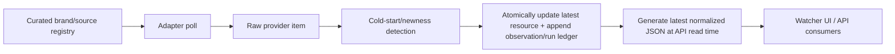

# ARGUS Intelligence Crawler — System Overview

*Plain-language overview. For implementation details, see
[intellegence_crawler.md](intellegence_crawler.md).*

## In One Sentence

The intelligence crawler collects digital ads from curated US brand sources, stores
raw provider evidence and artifacts, and exposes a normalized JSON/API surface for
review and later analysis.

## What It Solves

Digital ads live across platform libraries, brand channels, feeds, and publisher
surfaces. Manually checking those places is slow and fragile. The crawler gives
ARGUS a local inventory of observed digital creatives with:

- source provenance,
- original provider URLs,
- screenshots and media URLs,
- provider-derived metadata snapshots,
- normalized cross-provider JSON,
- timestamps for first seen/fetched/provider-published dates.

## Current Sources

| Source | Current role |
|---|---|
| Google Ads Transparency Center | US commercial Google creatives by advertiser id (`AR...`), collected through the ATC internal JSON-RPC. |
| Meta Ad Library | US commercial Meta cards by verified Facebook Page ID, collected through the public UI probe. |
| YouTube channel feed | Official brand upload monitoring, with optional Data API duration enrichment. |
| RSS / Atom | Official newsroom or trade-feed monitoring. |
| Mock | Offline testing and local smoke data. |

Reliability/provenance tiers are fixed by adapter family: Meta is A, Google Ads
Transparency is B, and YouTube/RSS/newsroom or other indirect discovery is C.

This is US-focused. The crawler keeps requested market context under
`normalized.collection.requested_region_code`, but it does not treat region as a primary
analysis axis for the demo.

## How It Works

Key behavior:

1. Sources live in `intel_sources`; `intelligence_crawler.yaml` only seeds them.
2. The first poll of a source records backfill and emits no live signal.
3. Re-polls refresh existing resources instead of duplicating them.
4. Provider-specific payloads stay in `metadata`.
5. Consumers use `normalized` for one stable shape across Google, Meta, and future adapters.
6. Provider failures have machine-readable causes; an incomplete result never advances the last-complete-success marker.

## What A Resource Represents

A resource is one provider creative/card/library item. For example:

- one Google ATC creative (`resource_type="atc_ad"`),
- one Meta Ad Library card (`resource_type="meta_ad"`),
- one YouTube upload,
- one RSS/newsroom item.

The resource may have artifacts: card screenshots, provider image URLs, video URLs,
video posters, background images, and clickout links.

## What It Does Not Do Yet

- It does not run OCR/transcript/VLM classification on crawler media.
- It does not download every remote video as a durable local file.
- It does not map digital ads to TV campaigns yet.
- It does not claim full digital-market coverage. It collects what configured sources expose.

Those are downstream processing steps, likely owned by a separate analyzer service or
pipeline stage that consumes crawler resource JSON and artifacts.

## Demo Baseline

Current local demo data is intentionally small and reliable:

- McDonald's Google ATC: 9 resources.
- McDonald's Meta Ad Library: 172 resources.
- Both sources enabled.

This avoids depending on a broad live Google crawl during a demo, where repeated ATC
requests can trigger HTTP 429.
